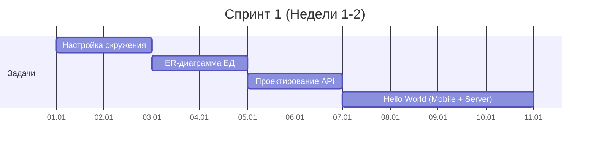
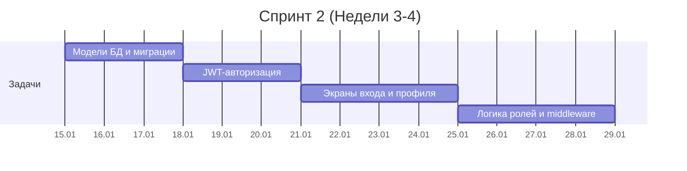
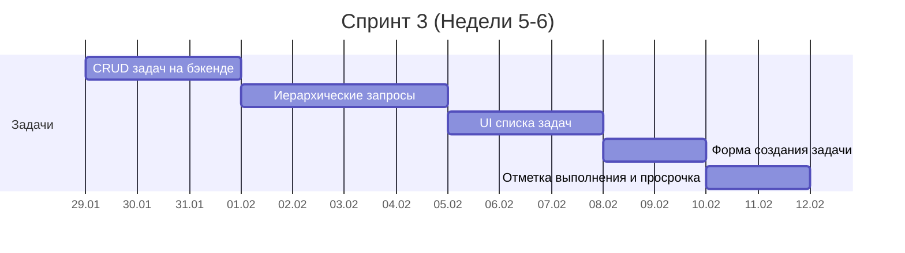
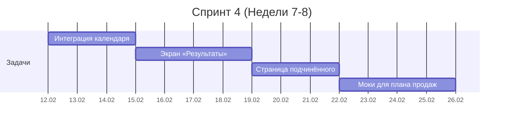
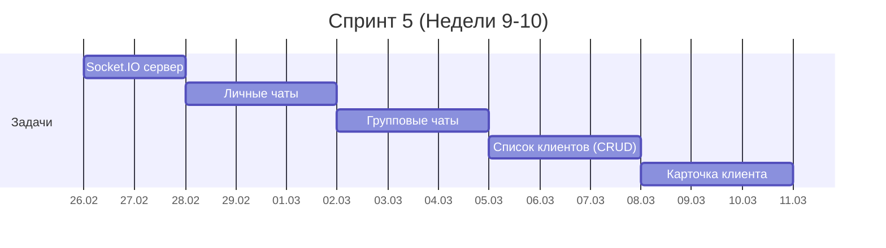
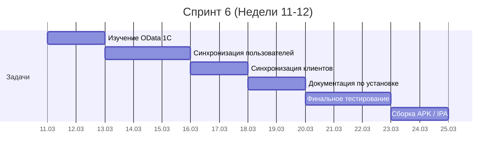
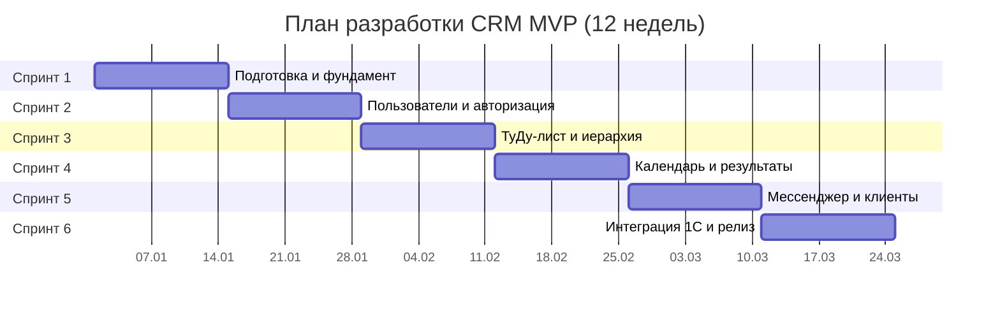

вкладки:
1) туду лист 
2) результаты
3) чаты
4) календарь 
5) месенджер чат
6) клиенты
# туду_лист
имеешь создавать задания (в зависимости от твоего статуса(директор глава отдела продажник и тд))
обычный продажник может создавать задания для себя и для группы людей. - тыкает создать аданиче- плашка:срок, название, кому, фото мб
директор\глава отдела продаж: аналогично, (директор может посмотретьне только свои задания но и задания всех людей, у глаы отдела продаж аналогично но только внутри своего отдела продаж)

поддерживается иерахическое дерево, что-то типо частичной упорядоченности. 
меньший класс не может даватьзаданию высшим, но наоборот поддерживается. + можно вписывать в туду лист свои задания как заметки для себя на равне с другими

пример (есть задание для бугалтерии): его видит директор и бугалтерия, 
пример (есть задание для отдела продаж): его видит директор и отдел продаж - ну как в дереве ЧУМ - бугалтерия и отдел продаж не сравнимы между собой, хоть и назодятся на одном "уровне" 

***кодга кто-то например диреткор выбирает из списка людей кому он поручает задание - там список людей (который нужно будет подтянуть из 1C как и базу клиентов в будущем) - его надо так чтобы отделы были разделены по цветам для удобства

***если ты выполнил задачу ты ставишь галочку о выполнении - коментарий по желанию о выполнении
если галочку не поставил - задача стала просроченой, можно напистаь окментарий почему она стала просроченой - ведь глава отдела и директор имеет возможность наблюдать за этим

# календарь
так же для визуализации есть календарь в котором можно смотреть задания на основе дедлайнов которые были выставлены на этапе создания задания 

# результаты
Обычные сотрудники имеют право видеть свои результаты: есть план продаж на месяц - прогресс бар
статистика по задачам - сколько создано - сколько выполнена => эвективность 
у старших пользователей свои результаты + есть список людей в который можно провалится на странички пользователей - где есть статистика и отчеты о выполненых/невыполненых задачах + коментарии
?: так же можно добавить возможность синхронизации с результатами из 1C о статискике продажи


# мессенджер
высшее звено может создаввать группы из низжих
у групп есть возможность подгрупп
директор - подключен к любому чату
можно закреплять сообщения 
у директора на страничке с человеком моно перейти в чат с ним 

# клиент
список клиентов - поиск - можно провалится в карточку там фио руководителя - адресс то как связаться - данный нужно подтянуть из 1C


Отлично, зафиксируем всё наглядно. Ниже — полноценный документ для Obsidian (Markdown + Mermaid). Копируйте его в новую заметку, и Obsidian автоматически отобразит все диаграммы и списки.

Я подготовил **три раздела**:
1. **Общая архитектура** — визуальная схема проекта.
2. **Технологический стек** — таблица выбранных инструментов.
3. **Подробный план разработки (3 месяца)** — детализированный список задач с разбивкой по спринтам и оценкой времени.

---

# 📱 CRM-система для МСБ – План разработки MVP

> Проект: Мобильное приложение + бэкенд для управления задачами, чатами и клиентами с on-premise развёртыванием.  
> Команда: 2 junior-разработчика (СПб).  
> Срок: 2–3 месяца средней-плотной работы.

---

## 🏗️ Архитектура проекта (On-Premise)

```mermaid
flowchart LR
    subgraph Мобильные устройства
        A1[iOS / Android]
        A2[React Native App]
    end

    subgraph Сервер клиента (on-premise)
        B[Node.js + Express API]
        C[(PostgreSQL)]
        D[Socket.IO Server]
    end

    subgraph Внешние системы
        E[1С:Предприятие<br>OData]
    end

    A2 --> B
    B --> C
    B --> D
    B --> E
    D <--> A2
```

**Ключевые решения:**
- **Backend разворачивается на сервере заказчика** (Docker-контейнер или Node.js напрямую).
- **База данных одна** для всех пользователей компании.
- **Связь с 1С** через стандартный OData-интерфейс (только чтение на MVP).

---

## 🧰 Технологический стек

| Слой | Технология | Обоснование |
|------|------------|-------------|
| **Клиент (Мобильное приложение)** | React Native + TypeScript | Один код для iOS и Android; TypeScript – надёжность и автодополнение. |
| **Клиент (Будущий Web)** | React (переиспользование кода) | Можно будет собрать веб-версию из тех же компонентов. |
| **Сервер** | Node.js + Express.js + TypeScript | Простота, огромное сообщество, единый язык с клиентом. |
| **База данных** | PostgreSQL | Реляционная модель идеальна для иерархий, ролей и связей. |
| **Реальное время (чат)** | Socket.IO | Удобная реализация WebSocket, комнаты для групповых чатов. |
| **Интеграция с 1С** | OData (протокол) | Поддерживается «из коробки» платформой 1С. |
| **Развёртывание** | Docker (опционально) | Упростит установку на сервер клиента. |

---

## 📋 Подробный план разработки (3 месяца, 6 спринтов)

### Спринт 1: Подготовка и фундамент (Недели 1–2)

**Цель:** Настроить среду разработки, спроектировать БД и создать скелет приложения.



#### 🔧 Подробные задачи Спринта 1

| ID | Задача | Описание | Результат | Время (ч) |
|----|--------|----------|-----------|-----------|
| 1.1 | Установка инструментов | VS Code, Node.js, Git, Android Studio (эмулятор), PostgreSQL | Готовое рабочее место у обоих | 8 |
| 1.2 | Создание репозитория | GitHub/GitLab, `.gitignore`, ветки `main` и `dev` | Доступ к коду у всей команды | 2 |
| 1.3 | ER-диаграмма базы данных | Спроектировать таблицы: `users`, `roles`, `departments`, `tasks`, `chats`, `clients` | Визуальная схема в Figma / dbdiagram.io | 12 |
| 1.4 | OpenAPI спецификация | Описать эндпоинты API в формате Swagger | Документ `api-spec.yaml` | 8 |
| 1.5 | Инициализация React Native проекта | `npx react-native init` с TypeScript шаблоном | Приложение запускается на эмуляторе | 4 |
| 1.6 | Инициализация Express сервера | Простой сервер с одним роутом `/ping` | Сервер отвечает на запросы | 4 |
| 1.7 | Связка клиент-сервер | Тестовый запрос из приложения на `/ping` | В консоли видно успешное соединение | 4 |

---

### Спринт 2: Пользователи и авторизация (Недели 3–4)

**Цель:** Реализовать регистрацию, вход, разграничение прав (роли).



#### 🔧 Подробные задачи Спринта 2

| ID | Задача | Описание | Результат | Время (ч) |
|----|--------|----------|-----------|-----------|
| 2.1 | Создание таблиц в PostgreSQL | Написать SQL-скрипты или использовать ORM (Prisma/TypeORM) | База готова к подключению | 6 |
| 2.2 | Регистрация пользователя | Эндпоинт `POST /auth/register` с хешированием пароля (bcrypt) | Можно создать нового пользователя через Postman | 8 |
| 2.3 | Вход и выдача JWT | Эндпоинт `POST /auth/login`, возвращает токен | Получение токена при успешном входе | 8 |
| 2.4 | Экран входа в приложении | Поля email/пароль, кнопка «Войти», обработка ошибок | Пользователь попадает в основной экран после логина | 12 |
| 2.5 | Защищённые роуты на бэкенде | Middleware, проверяющий JWT в заголовке `Authorization` | К защищённым эндпоинтам нельзя обратиться без токена | 6 |
| 2.6 | Роли пользователей | Добавить поле `role` (admin, manager, employee) и связь с отделами | Бэкенд различает уровни доступа | 8 |
| 2.7 | Middleware проверки прав | Функции `isDirector`, `isDepartmentHead`, `canAssignTaskTo(user)` | Готовые проверки для следующих спринтов | 10 |
| 2.8 | Экран профиля | Отображение имени, роли, отдела. Кнопка «Выйти» | Базовая навигация | 6 |

---

### Спринт 3: Ядро – ТуДу-лист с иерархией (Недели 5–6)

**Цель:** Реализовать создание, отображение и выполнение задач с учётом сложной иерархии подчинения.



#### 🔧 Подробные задачи Спринта 3

| ID | Задача | Описание | Результат | Время (ч) |
|----|--------|----------|-----------|-----------|
| 3.1 | Модель задачи в БД | Таблица `tasks`: id, title, description, deadline, status, creator_id, assignee_id, department_id | Готовая структура | 4 |
| 3.2 | CRUD API для задач | Эндпоинты `GET`, `POST`, `PATCH /tasks` | Можно создавать/редактировать задачи через API | 12 |
| 3.3 | **Иерархический запрос задач** | **Самое сложное.** SQL-запрос (или логика на бэкенде), который возвращает:<br>- Для директора: все задачи.<br>- Для главы отдела: задачи, где `department_id` = его отдел.<br>- Для сотрудника: задачи, где он исполнитель или создатель.<br>**Учесть несравнимые отделы (бухгалтерия vs продажи).** | Метод `getTasksForUser(userId)` работает корректно | 16 |
| 3.4 | Список исполнителей с цветами отделов | Эндпоинт `GET /users/assignable` с фильтрацией по правам текущего пользователя и цветовой меткой отдела | API возвращает список пользователей для выпадающего списка | 8 |
| 3.5 | UI экран «Задачи» | Компонент `TaskList` с фильтрацией по статусу (активные/просроченные) | Пользователь видит свои задачи | 10 |
| 3.6 | Форма создания задачи | Поля: название, описание, дедлайн, выбор исполнителя из раскрашенного списка | Новая задача появляется в списке | 12 |
| 3.7 | Отметка о выполнении | Чекбокс в элементе списка, при нажатии – `PATCH /tasks/:id { status: 'done' }` | Задача исчезает из активных | 6 |
| 3.8 | Визуализация просрочки | Если `deadline < now` и статус не 'done', подсветить красным | Пользователь видит горящие задачи | 4 |
| 3.9 | Комментарий к просрочке/выполнению | Поле ввода в карточке задачи, сохраняется в отдельную таблицу `task_comments` | История и причины видны руководителю | 8 |

---

### Спринт 4: Календарь и результаты (Недели 7–8)

**Цель:** Сделать данные наглядными с помощью календаря и дашбордов эффективности.



#### 🔧 Подробные задачи Спринта 4

| ID | Задача | Описание | Результат | Время (ч) |
|----|--------|----------|-----------|-----------|
| 4.1 | Библиотека календаря | Установить `react-native-calendars` | Готовый компонент | 2 |
| 4.2 | Эндпоинт задач для календаря | `GET /tasks/calendar?month=...` – возвращает задачи с датами | Данные для отображения точек на днях | 6 |
| 4.3 | Экран «Календарь» | Отображение календаря с маркерами задач. При клике на день – список задач на эту дату. | Работает навигация по датам | 10 |
| 4.4 | Экран «Результаты» – сотрудник | Компонент `ProgressBar` (план продаж). Статистика: всего задач / выполнено / просрочено. | Сотрудник видит свои KPI | 8 |
| 4.5 | Эндпоинт статистики для руководителя | `GET /users/:id/statistics` с проверкой прав (глава видит только свой отдел) | API возвращает агрегированные данные | 8 |
| 4.6 | Экран «Результаты» – руководитель | Список подчинённых. При клике – переход на страницу сотрудника с детальной статистикой. | Руководитель видит эффективность команды | 12 |
| 4.7 | План продаж (заглушка) | Поле `sales_plan` в таблице `users`. В будущем синхронизация с 1С. | Данные для прогресс-бара | 4 |

---

### Спринт 5: Мессенджер и база клиентов (Недели 9–10)

**Цель:** Добавить коммуникацию и базу клиентов.



#### 🔧 Подробные задачи Спринта 5

| ID | Задача | Описание | Результат | Время (ч) |
|----|--------|----------|-----------|-----------|
| 5.1 | Подключение Socket.IO к серверу | Инициализация, аутентификация через JWT при подключении | Клиенты могут подключаться к вебсокету | 6 |
| 5.2 | Модель сообщения и комнаты | Таблицы `chats` (личный/групповой), `messages` | Данные сохраняются в БД | 6 |
| 5.3 | Личные чаты | Возможность отправить сообщение пользователю. Директор видит все чаты. | Базовый обмен сообщениями работает | 12 |
| 5.4 | Создание групп (только для руководителей) | Эндпоинт `POST /chats/group`, в параметрах – список ID участников | Руководитель может создать чат для отдела | 10 |
| 5.5 | Автоматическое добавление директора | Middleware при создании группы или при подключении к любому чату | Директор видит все сообщения | 6 |
| 5.6 | Закрепление сообщений | Добавить флаг `pinned` в таблице `messages`. Эндпоинт `PATCH /messages/:id/pin`. | Руководитель может закреплять важное | 8 |
| 5.7 | Экран чатов (список) | Компонент с превью последних сообщений | Пользователь видит все свои диалоги | 8 |
| 5.8 | Экран конкретного чата | Отправка сообщений, загрузка истории, индикатор онлайн | Полноценный чат | 12 |
| 5.9 | CRUD для клиентов | Таблица `clients`, эндпоинты `GET`, `POST`, `PATCH`, `DELETE /clients` | База клиентов готова к наполнению | 8 |
| 5.10 | Экран «Клиенты» | Поиск, список, карточка с полями (ФИО руководителя, адрес, контакты) | Готовый справочник | 8 |

---

### Спринт 6: Интеграция с 1С, развёртывание, тестирование (Недели 11–12)

**Цель:** Подключить реальные данные из 1С, подготовить инструкцию для клиента, отполировать продукт.



#### 🔧 Подробные задачи Спринта 6

| ID | Задача | Описание | Результат | Время (ч) |
|----|--------|----------|-----------|-----------|
| 6.1 | Настройка тестового OData-сервиса 1С | Развернуть демо-базу 1С с опубликованным OData (или использовать мок-сервер) | URL для тестирования | 8 |
| 6.2 | Модуль интеграции на бэкенде | Сервис `OneCService`, который делает GET-запросы к OData и парсит JSON | Данные из 1С поступают в нашу систему | 12 |
| 6.3 | Синхронизация пользователей | При создании/обновлении пользователя подтягивать ФИО, должность, отдел из 1С | Пользователи в приложении соответствуют штатному расписанию | 12 |
| 6.4 | Синхронизация клиентов | Эндпоинт `POST /sync/clients` для ручного или периодического запуска | Клиенты из 1С появляются в справочнике | 8 |
| 6.5 | Инструкция по on-premise установке | Файл `INSTALL.md`: требования, установка Node.js, PostgreSQL, запуск сервера, создание базы | Клиент может самостоятельно развернуть систему | 8 |
| 6.6 | Тестирование полного цикла | Пройти все пользовательские сценарии: вход, создание задачи, выполнение, чат, просмотр статистики | Исправлены критические баги | 20 |
| 6.7 | Оптимизация UI/UX | Проверить отступы, цвета, индикаторы загрузки | Приложение выглядит аккуратно | 8 |
| 6.8 | Сборка Android APK | Настройка `gradle`, генерация подписанного APK | Готовый файл для установки на телефон | 4 |
| 6.9 | Сборка iOS (опционально) | Требуется Mac и Apple Developer Account. Для MVP можно пропустить. | - | - |

---

## 🎯 Итоговая диаграмма Ганта (общий вид)



---


Теперь наша задача — превратить этот план в работающий код, и начать нужно с самого важного и сложного. Предлагаю сфокусироваться на Спринте 3: Ядро – ТуДу-лист с иерархией, так как:

    Это центральная функция, вокруг которой строится всё остальное.

    Здесь скрыта самая сложная логика, связанная с частично упорядоченной иерархией (ЧУМ) и разграничением прав.

    Успешная реализация этого модуля даст нам готовый каркас для пользователей, ролей и API, к которому потом легко будет "прикручивать" календарь, мессенджер и интеграции.

Давай начнем с первого и самого важного шага в этом спринте — проектирования базы данных и API для работы с задачами и иерархией.
📝 Задачи на ближайшие дни

Вот пошаговый план, который позволит нам заложить правильный фундамент для всей системы.

    Создадим структуру таблиц в PostgreSQL.
    Основываясь на вашем плане, нужно создать таблицы departments (отделы), users (пользователи) и tasks (задачи). В файле хотелки.md уже есть хорошая основа для этого (см. задачи 1.3 и 3.1).

    Спроектируем и реализуем API для задач.
    Нам понадобятся эндпоинты для создания, просмотра и обновления задач. Ключевой момент — эндпоинт для получения списка задач (GET /tasks), который должен возвращать разные данные в зависимости от роли пользователя:

        Для сотрудника: только его задачи (где он исполнитель или создатель).

        Для главы отдела: задачи всего его отдела.

        Для директора: все задачи в системе.

        Важно учесть правило из вашего документа: "бугалтерия и отдел продаж не сравнимы между собой, хоть и находятся на одном 'уровне'". Это значит, что глава отдела продаж не должен видеть задачи бухгалтерии, и наоборот.

    Реализуем специальный эндпоинт для выбора исполнителя.
    При создании задачи руководитель должен выбирать исполнителя из списка. Нужно сделать эндпоинт GET /users/assignable, который вернет всех, кому текущий пользователь может поручить задачу. Для сотрудника — это, возможно, только он сам и его коллеги. Для директора — все пользователи системы. Тут же нужно отдавать цветовую метку отдела для UI.
